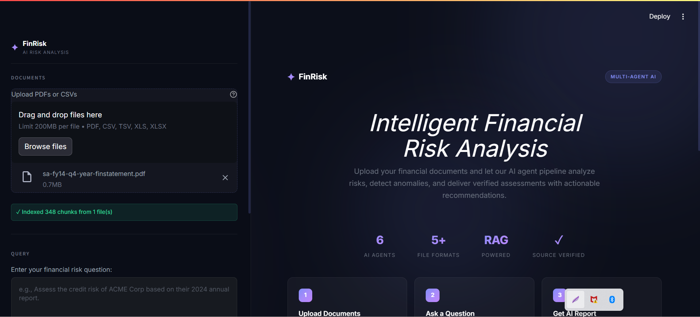
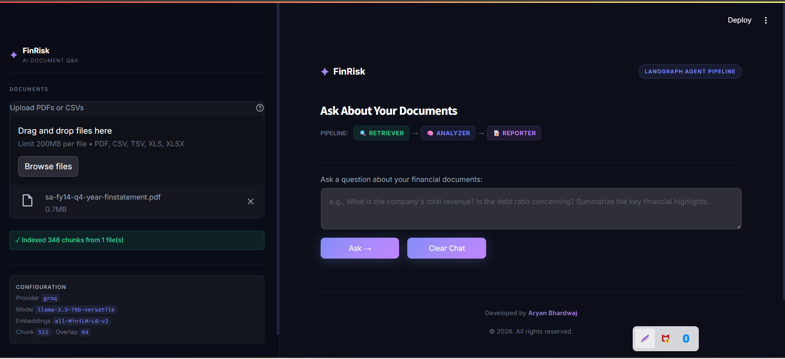
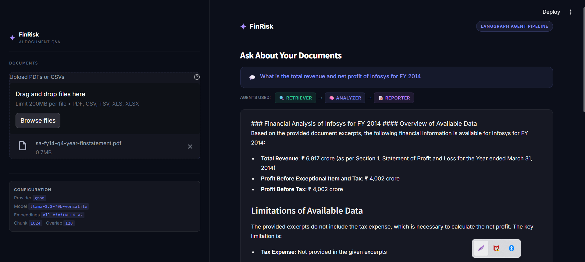

# FinRisk: Financial Document Q&A with RAG + LangGraph

FinRisk is a Streamlit application for querying financial documents (`PDF`, `CSV`, `TSV`, `XLS`, `XLSX`) using retrieval-augmented generation.

It ingests documents, builds a FAISS index from local sentence-transformer embeddings, and answers questions through a LangGraph pipeline with source citations.

## UI Preview

### 🏠 Landing Page
<p align="center">
  
</p>

### 📤 Upload & Indexing
<p align="center">
  
</p>

### 📊 Financial Analysis Output
<p align="center">
  
</p>

## What is implemented today

The **active runtime flow** (used by `app.py`) is:

1. Ingestion (`ingestion/pdf_loader.py`, `ingestion/csv_loader.py`)
2. Chunking (`rag/chunker.py`)
3. Embedding + FAISS persistence (`rag/embedder.py`)
4. Q&A pipeline (`rag/qa.py` -> `graph/workflow.py`)

The current LangGraph Q&A graph has **3 nodes**:

`retriever -> analyzer -> reporter`

## Architecture overview

```text
Upload files in Streamlit
        |
        v
Ingestion layer
  - PDF: pdfplumber (tables) + PyMuPDF fallback
  - Tabular: pandas summary generator
        |
        v
Chunker (table-preserving + sentence-safe splits)
        |
        v
Embedder (HuggingFace sentence-transformers, CPU)
        |
        v
FAISS vector store on disk
        |
        v
LangGraph Q&A workflow
  Retriever -> Analyzer -> Reporter
        |
        v
Answer + source snippets + agent trace in Streamlit
```

## Tech stack

### Core
- Python 3.11+ (project has local `venv`)
- Streamlit (`1.41.1`) for UI
- LangChain (`0.3.14`) + LangGraph (`0.2.60`)
- FAISS CPU (`1.13.2`) via `langchain-community`
- sentence-transformers (`3.3.1`) for local embeddings

### LLM providers (configurable)
- Groq via `langchain-groq` (`0.3.0`)
- Google Gemini via `langchain-google-genai` (`>=2.0.0`)
- OpenAI via `langchain-openai` (`0.3.0`) + `openai` (`1.58.1`)

### Document processing + data
- `pdfplumber` (`0.11.4`)
- `pymupdf` (`1.25.1`)
- `pandas` (`2.2.3`)
- `numpy` (`1.26.4`)

### Utilities / testing
- `python-dotenv` (`1.0.1`)
- `pytest` (`8.3.4`)
- `reportlab` (`4.2.5`)
- Optional: `mlflow` (`2.19.0`, commented in requirements)

## Repository structure

```text
project_rag/
├── app.py                    # Streamlit UI and upload/query orchestration
├── config.py                 # Immutable env-backed settings dataclass
├── requirements.txt
├── .env.example
├── data/                     # Uploaded source documents
├── vector_store/             # Persisted FAISS index files
├── ingestion/
│   ├── pdf_loader.py         # PDF text+table extraction with fallback
│   └── csv_loader.py         # CSV/TSV/XLS/XLSX summary loader
├── rag/
│   ├── chunker.py            # Financial-document-aware chunking
│   ├── embedder.py           # Embedding model + FAISS save/load
│   ├── retriever.py          # MMR/scored/hybrid retrieval
│   └── qa.py                 # ask_question wrapper
├── graph/
│   ├── state.py              # Extended state model (not in active Q&A path)
│   └── workflow.py           # Active 3-node LangGraph workflow
├── agents/                   # Extended/experimental agents
│   ├── planner.py
│   ├── retriever_agent.py
│   ├── analyst.py
│   ├── evaluator.py
│   ├── verifier.py
│   └── reporter.py
├── utils/
│   ├── llm_factory.py        # Provider switch + retry wrapper
│   ├── financial_ratios.py   # Ratio engine + threshold interpretation
│   ├── mlflow_tracker.py     # Optional experiment tracking
│   └── logger.py
└── tests/
    ├── conftest.py
    └── test_pipeline.py
```

## Configuration

Copy `.env.example` to `.env` and set values:

```env
LLM_PROVIDER=groq            # groq | gemini | openai
LLM_MODEL=llama-3.3-70b-versatile
EMBEDDING_MODEL=all-MiniLM-L6-v2
VECTOR_DB_PATH=./vector_store
CHUNK_SIZE=512
CHUNK_OVERLAP=64
LOG_LEVEL=INFO
```

Provider-specific keys:
- `GROQ_API_KEY`
- `GOOGLE_API_KEY`
- `OPENAI_API_KEY`

## Setup and run

### Windows (PowerShell or Command Prompt)

```bash
python -m venv venv
venv\Scripts\activate
pip install -r requirements.txt
streamlit run app.py
```

### macOS/Linux

```bash
python -m venv venv
source venv/bin/activate
pip install -r requirements.txt
streamlit run app.py
```

## How the UI behaves

- Uploads are saved to `data/`.
- New uploads trigger:
  - ingestion
  - chunking
  - embedding
  - FAISS persistence to `VECTOR_DB_PATH`
- Questions are answered via `rag.qa.ask_question()`.
- Each response stores:
  - formatted answer
  - sources (file/page + excerpt)
  - `agent_trace` for Retriever/Analyzer/Reporter

## Retrieval and RAG details

### PDF ingestion
- Primary extractor: `pdfplumber`
- Fallback extractor: `PyMuPDF`
- Extracted tables are serialized as Markdown.

### Tabular ingestion
- Supports `csv`, `tsv`, `xls`, `xlsx`
- Produces dataset summaries:
  - shape
  - inferred column types
  - numeric stats
  - top categorical values
  - datetime ranges
  - null counts

### Chunking strategy
- Preserves Markdown table blocks as standalone chunks.
- Uses separators tuned for financial text (`\n\n`, `. `, `; `, etc.).
- Adds metadata (`source`, `page`, `chunk_index`, `char_count`, `is_table`).

### Retrieval options
- MMR retrieval
- similarity + score retrieval
- hybrid retrieval (vector + keyword rerank)

## Notes on extended modules

This repository also contains a richer multi-agent risk-analysis layer (`agents/*`, `graph/state.py`, ratio engine, MLflow tracker).

Those modules are present and partially tested, but the current Streamlit runtime path is the 3-node Q&A workflow in `graph/workflow.py`.

## Testing

Run:

```bash
pytest tests -v
```

The test suite includes:
- PDF ingestion checks
- chunking/embedding/retrieval checks
- financial ratio unit tests
- integration-style workflow expectations

## License

This project is licensed under the MIT License. See [LICENSE](LICENSE).
